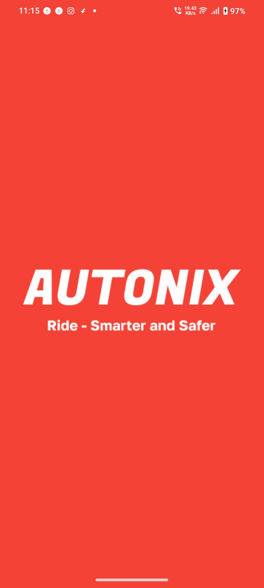
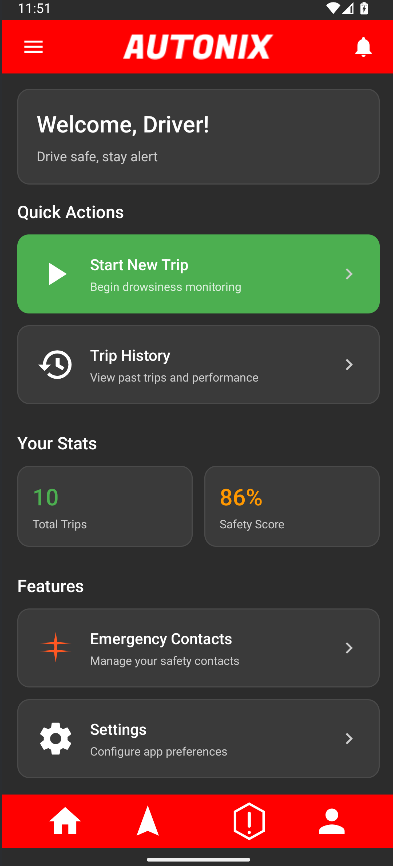
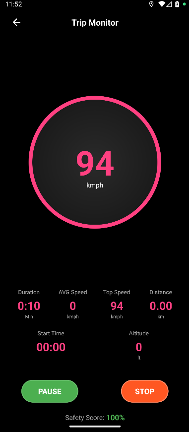

<div align="center">


# AUTONIX — Official Website

### The official website for the Autonix Rider Safety System

> **❝ Safety for all. Accessible to all. ❞**

---


---

🌐 [**Live Website**](https://yatin-anchan.github.io/AUTONIX-Website/) &nbsp;|&nbsp;
📲 [**Download App**](https://github.com/yatin-anchan/AUTONIX-Website/releases/download/APP/AUTONIX_v1.0.apk) &nbsp;|&nbsp;
📱 [**App Repository**](https://github.com/yatin-anchan/Autonix) &nbsp;|&nbsp;
🐞 [**Report Bug**](https://github.com/yatin-anchan/AUTONIX-Website/issues)

</div>

---

## 📖 About This Repository

This repository contains the **official marketing and documentation website** for the Autonix project — an intelligent smartphone-based driver safety system.

The website is a **static, no-framework HTML/CSS/JS site** with a futuristic cyber aesthetic — dark backgrounds, red accent lighting, Orbitron typography, animated grid backgrounds, and cinematic transitions — all designed to reflect the high-tech nature of the Autonix application.

---

## 🗂️ Repository Structure

```
AUTONIX-Website/
│
├── index.html              # Home page — hero, features overview, about
├── features.html           # Detailed features breakdown
├── screenshots.html        # App screenshot gallery
├── dowmnload.html          # Download page with APK release
├── support.html            # Support & contact
├── presentation.html       # Cinematic project exhibition slideshow
│
├── images/
│   ├── screenshots/        # App UI screenshots (screenshot-1.png … screenshot-6.png)
│   ├── features/           # Feature illustration images
│   └── illulstration.png   # About section hero illustration
│
└── README.md               # This file
```

---

## 🖥️ Pages

| Page | File | Description |
|:-----|:-----|:------------|
| **Home** | `index.html` | Hero section, feature pills, about section, tech stack, CTA |
| **Features** | `features.html` | Deep-dive into all 4 core features with tech specs |
| **Screenshots** | `screenshots.html` | Horizontal scroll gallery of app UI screenshots |
| **Download** | `dowmnload.html` | APK download with system requirements |
| **Support** | `support.html` | FAQ, contact form, bug reporting |
| **Presentation** | `presentation.html` | Fullscreen cinematic exhibition slideshow |

---

## ✨ Design System

The website uses a consistent **cyber / dark-tech** design language throughout:

| Token | Value | Usage |
|:------|:------|:------|
| `--primary-red` | `#ff0033` | Accents, borders, glows |
| `--dark-bg` | `#0a0a0a` | Page background |
| `--darker-bg` | `#050505` | Card backgrounds |
| `--light-text` | `#ffffff` | Primary text |
| `--gray-text` | `#888888` | Secondary text |
| `--glow-red` | `rgba(255,0,51,0.5)` | Box shadows & drop shadows |
| `--border-red` | `rgba(255,0,51,0.3)` | Subtle borders |

**Fonts used:**
- [`Orbitron`](https://fonts.google.com/specimen/Orbitron) — Display / headings / UI labels
- [`Rajdhani`](https://fonts.google.com/specimen/Rajdhani) — Body text
- [`Share Tech Mono`](https://fonts.google.com/specimen/Share+Tech+Mono) — Code / terminal text

**External libraries (CDN only — no build step):**
- [Bootstrap 5.3](https://getbootstrap.com/) — Layout & utilities
- [Font Awesome 6.4](https://fontawesome.com/) — Icons
- [AOS 2.3](https://michaelangelosilva.github.io/aos/) — Scroll animations

---

## 🚀 Running Locally

No build tools, no npm, no dependencies to install. Just open and go.

```bash
# Clone the repository
git clone https://github.com/yatin-anchan/AUTONIX-Website.git

# Navigate into the folder
cd AUTONIX-Website

# Open in browser — any of these work:
open index.html                        # macOS
start index.html                       # Windows
xdg-open index.html                    # Linux
```

Or use a local dev server for the best experience:

```bash
# With VS Code Live Server extension (recommended)
# Right-click index.html → Open with Live Server

# With Python
python -m http.server 8080
# Then visit http://localhost:8080

# With Node.js (npx)
npx serve .
```

---

## 🌐 Deployment

The site is hosted on **GitHub Pages** and deploys automatically from the `main` branch.

| Setting | Value |
|:--------|:------|
| Hosting | GitHub Pages |
| Branch | `main` |
| Root | `/` (repository root) |
| Live URL | https://yatin-anchan.github.io/AUTONIX-Website/ |

To deploy your own fork:
1. Fork this repository
2. Go to **Settings → Pages**
3. Set source to `Deploy from a branch` → `main` → `/ (root)`
4. Your site will be live at `https://<your-username>.github.io/AUTONIX-Website/`

---

## 📸 Preview

<div align="center">

| Home | Features | Screenshots |
|:----:|:--------:|:-----------:|
|  |  |  |

</div>

---

## 🔗 Related

| Resource | Link |
|:---------|:-----|
| 📱 Autonix App Repository | [github.com/yatin-anchan/Autonix](https://github.com/yatin-anchan/Autonix) |
| 🔍 Research Paper | [aijfr.com — Paper #1559](https://www.aijfr.com/research-paper.php?id=1559) |
| 📖 Full Documentation | [Google Drive](https://drive.google.com/file/d/169wh8a7fB0qaTMDbBEBixVDqTYjoomHM/view?usp=drivesdk) |
| 📲 Download APK v1.0 | [GitHub Releases](https://github.com/yatin-anchan/AUTONIX-Website/releases/download/APP/AUTONIX_v1.0.apk) |

---

## 👥 Built By

<div align="center">

<table>
<tr>
<td align="center" width="50%">
<a href="https://github.com/maizahshaikh1004">
  
  <br/><br/>
  <strong>Maizah Shaikh</strong><br/>
  <sub>Developer & Researcher</sub><br/><br/>
  
</a>
</td>
<td align="center" width="50%">
<a href="https://github.com/yatin-anchan">
  
  <br/><br/>
  <strong>Yatin Anchan</strong><br/>
  <sub>Developer & System Architect</sub><br/><br/>
  
</a>
</td>
</tr>
</table>

**Department of Computer Science**
Royal College of Arts, Science & Commerce — Mira Road (E), Maharashtra 2025

</div>

---

## ⚖️ License

[](../Autonix/blob/main/LICENSE)

This website and all its assets are open-source under the **MIT License**.

---

<div align="center">

*❤️ Made with dedication to road safety*

**© 2025 Autonix Project** | Built with ❤️ and ☕ in India

</div>
